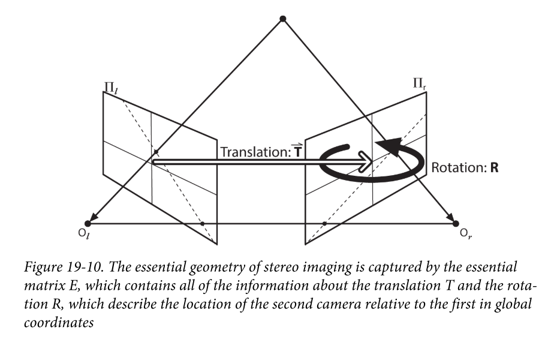
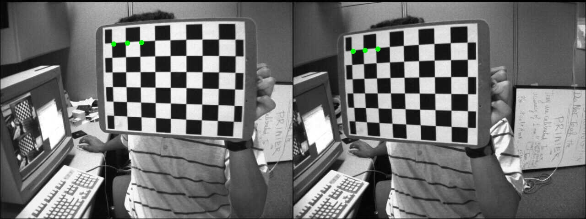

# 【双目标定01】外参的作用

相机内参的标定教程详见 https://zhuanlan.zhihu.com/p/456097530 。【双目标定】系列重点解释双目外参的作用的由来。

双目标定的目的是把两个相机成像平面的空间几何位置关系计算出来，也就是旋转和平移关系，我们把旋转 $R$ 和平移向量 $\vec T$ 称作**双目外参**。

其中，位置关系是右侧相机相对于左侧的。如下图所示：



##### 示例

示例点的3维坐标：

```python
points = np.array([[-48.831894, -86.462112, 316.351135],
                       [-29.942320, -85.639320, 311.097839],
                       [-11.202976, -85.063042, 306.122345]])
```

已标定好的外参：

```yaml
R: !!opencv-matrix
   rows: 3
   cols: 3
   dt: d
   data: [ 9.9997149582097056e-01, 4.8210099095713048e-03,
       5.8108010654681673e-03, -4.8866654189597975e-03,
       9.9992378064180176e-01, 1.1338139533845782e-02,
       -5.7556968868915587e-03, -1.1366211790109730e-02,
       9.9991883729775222e-01 ]
T: !!opencv-matrix
   rows: 3
   cols: 1
   dt: d
   data: [ -6.6854173871794771e+01, 9.3651842558909515e-01,
       7.3046818467824653e-02 ]
```

核心代码：

```python
def project2pixel(points, m):
    m1 = m['M1']
    d1 = m['D1']
    m2 = m['M2']
    d2 = m['D2']
    r = m['R']
    t = m['T']

    # project 3D points to image plane
    imgpts_l, _ = cv2.projectPoints(points, np.array(
        [0, 0, 0], np.float32), np.array([0, 0, 0], np.float32), m1, d1)
    imgpts_r, _ = cv2.projectPoints(points, r, t, m2, d2)
    imgpts_l = np.int32(imgpts_l).reshape(-1, 2)
    imgpts_r = np.int32(imgpts_r).reshape(-1, 2)

    return imgpts_l, imgpts_r
```

代码解析：

`imgpts_l` 与 `imgpts_r` 的唯一区别就是`projectPoints`的第二、三个参数，左目相机这两个参数都为0，右目传入事先标定好的外参 `R` 和`T`。其余代码请参考我的另一篇文章：https://zhuanlan.zhihu.com/p/413081555

运行输出的结果：

```
[[248  96]
 [278  94]
 [309  93]]
 
[[131 112]
 [157 110]
 [185 107]]
```

将结果可视化，我们更容易看出区别：




##### 小结

现在我们可以说，**双目外参就是使右相机的成像平面与左相机重合时左相机需要做的旋转和平移变换**。

但是，双目标定的目的不仅仅是求了外参，最终的目的是完成特征点的三维重建，即点的3D坐标，我们将会一步一步深入进去。