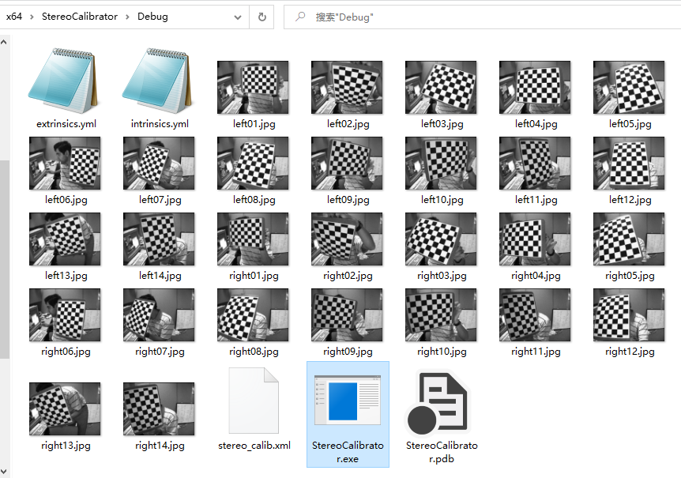
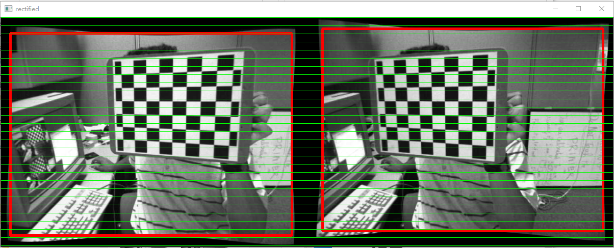

# 【双目标定03】双目标定实践

其实双目标定的最终目的是进行双目测距，但在完成这一目的之前我们还有很长的路要走。双目标定仅是最基本的一步，本节就带读者亲自动手来标定自己的双目。

我们依然通过OpenCV提供的sample来进行示例：

https://github.com/opencv/opencv/blob/1b443219ed181124978ed8627fb2da8db42765ab/samples/cpp/stereo_calib.cpp

##### 环境

- Win10
- Visual Studio

##### 实践

新建c++项目，并添加OpenCV的属性表（不熟悉的读者请参考https://zhuanlan.zhihu.com/p/444848515）。

将待标定的双目图片放入项目的生成目录中：




增加一个图片列表stereo_calib.xml

```xml
<?xml version="1.0"?>
<opencv_storage>
<imagelist>
"left01.jpg"
"right01.jpg"
"left02.jpg"
"right02.jpg"
"left03.jpg"
"right03.jpg"
"left04.jpg"
"right04.jpg"
"left05.jpg"
"right05.jpg"
"left06.jpg"
"right06.jpg"
"left07.jpg"
"right07.jpg"
"left08.jpg"
"right08.jpg"
"left09.jpg"
"right09.jpg"
"left11.jpg"
"right11.jpg"
"left12.jpg"
"right12.jpg"
"left13.jpg"
"right13.jpg"
"left14.jpg"
"right14.jpg"
</imagelist>
</opencv_storage>
```

运行

```shell
.\StereoCalibrator.exe -w=9 -h=6 -s="0.025" .\stereo_calib.xml
```





最终生成extrinsics.yml 和 intrinsics.yml

其中外参在extrinsics.yml中，intrinsics.yml为两个相机的内参（不再展示）：

```yaml
%YAML:1.0
---
R: !!opencv-matrix
   rows: 3
   cols: 3
   dt: d
   data: [ 9.9997149590084888e-01, 4.8210118938286708e-03,
       5.8107856730500789e-03, -4.8866672391438288e-03,
       9.9992378061127574e-01, 1.1338141441493870e-02,
       -5.7556814637747282e-03, -1.1366213633968206e-02,
       9.9991883736557063e-01 ]
T: !!opencv-matrix
   rows: 3
   cols: 1
   dt: d
   data: [ -8.3567716424567187e-02, 1.1706480900395583e-03,
       9.1304974305609667e-05 ]
R1: !!opencv-matrix
   rows: 3
   cols: 3
   dt: d
   data: [ 9.9994753462195274e-01, -9.1729735241686434e-03,
       4.5590086864971454e-03, 9.1468609887065278e-03,
       9.9994183001932746e-01, 5.7158998986865791e-03,
       -4.6111752874874474e-03, -5.6738993931358039e-03,
       9.9997327160686900e-01 ]
R2: !!opencv-matrix
   rows: 3
   cols: 3
   dt: d
   data: [ 9.9990130042617709e-01, -1.4006994538709719e-02,
       -1.0924788476907202e-03, 1.4000545590570504e-02,
       9.9988572507986573e-01, -5.7027628985846495e-03,
       1.1722325735336510e-03, 5.6869047384031333e-03,
       9.9998314235055485e-01 ]
P1: !!opencv-matrix
   rows: 3
   cols: 4
   dt: d
   data: [ 4.3964855446413702e+02, 0., 3.1932433700561523e+02, 0., 0.,
       4.3964855446413702e+02, 2.3945364761352539e+02, 0., 0., 0., 1.,
       0. ]
P2: !!opencv-matrix
   rows: 3
   cols: 4
   dt: d
   data: [ 4.3964855446413702e+02, 0., 3.1932433700561523e+02,
       -3.6744052348237197e+01, 0., 4.3964855446413702e+02,
       2.3945364761352539e+02, 0., 0., 0., 1., 0. ]
Q: !!opencv-matrix
   rows: 4
   cols: 4
   dt: d
   data: [ 1., 0., 0., -3.1932433700561523e+02, 0., 1., 0.,
       -2.3945364761352539e+02, 0., 0., 0., 4.3964855446413702e+02, 0.,
       0., 1.1965162424041377e+01, 0. ]

```

##### 关键代码

```cpp
    double rms = stereoCalibrate(objectPoints, imagePoints[0], imagePoints[1],
        cameraMatrix[0], distCoeffs[0],
        cameraMatrix[1], distCoeffs[1],
        imageSize, R, T, E, F,
        CALIB_FIX_ASPECT_RATIO +
        CALIB_ZERO_TANGENT_DIST +
        CALIB_USE_INTRINSIC_GUESS +
        CALIB_SAME_FOCAL_LENGTH +
        CALIB_RATIONAL_MODEL +
        CALIB_FIX_K3 + CALIB_FIX_K4 + CALIB_FIX_K5,
        TermCriteria(TermCriteria::COUNT + TermCriteria::EPS, 100, 1e-5));
```

`stereoCalibrate`提供了双目标定的所有功能，请读者自行学习使用。

##### 小结

示例代码在最后的检验阶段进行了立体校正，我们后面会涉及到，对于标定过程本身它不是必须的。

虽然标定过程我们已经学会，但是要实现双目测距，我们还需要补充很多知识，敬请期待。

