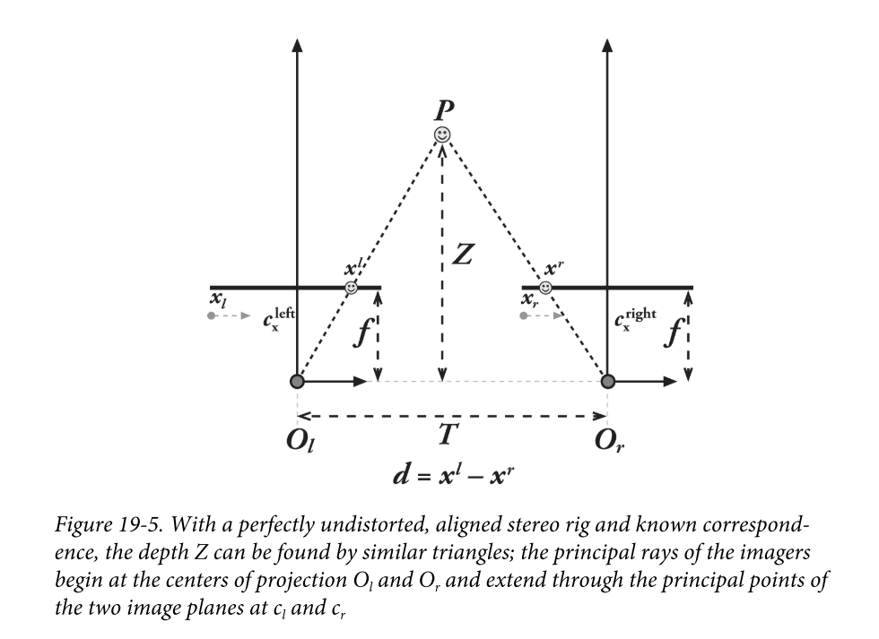
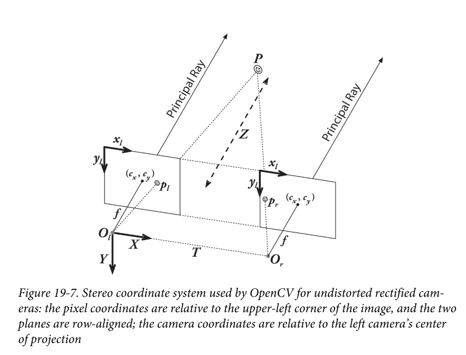
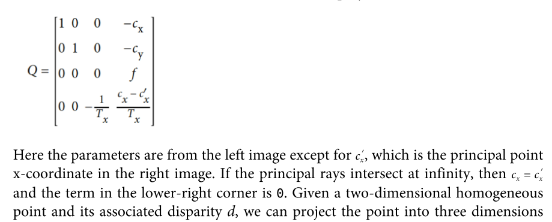

【双目标定05】双目相机模型--三角测量Triangulation

经过前三节的介绍，两个相机间的关系已经可以确定了，借助OpenCV强大的功能，我们甚至只需要宏观的了解双目外参的含义就可以完成标定。但到这里，新的问题产生了，那就是，为什么要使用双目？

模拟人类双眼构造，两个相机类似放置是可以计算出物体的距离的，这在实际应用中就非常有意义，可以廉价获取物体尝试信息。双目理想模型如下：

我们先解释一下理想双目模型：

- 相机无畸变

- 成像平面共面

- 相机光轴`optical axis`经过成像平面的中心

- 像平面行对齐`row-aligned`

  行对齐：物理世界中的一点投影在左成像平面中的像素位置与投影至右成像平面的像素位置处于同一行。

##### 三角测量

在上图中，假设有一点P可以同时投影至两个相机，我们可以根据简单的相似三角形，来计算出P点的3D坐标，具体过程如下：

首先需要介绍图中的几个符号：

- $T_x$：基线。表示左右相机光心的距离在x方向上的分量，以下记为$T$
- $f$：焦距
- $x^l, x^r$：点P在左右相机的投影位置
- $x_l, x_r$ ：像平面左边缘到P投影位置的距离

由于三角形$\Delta Px^lx^r$与$\Delta PO_lO_r$相似，故：
$$
\begin{align}
{x^lx^r \over T} &= {Z - f \over Z} \\
&\Rightarrow {T-(x_l -x_r) \over T} = {Z - f \over Z}\\
&\Rightarrow Z = {f \cdot T \over x_l - x_r}\\
&\Rightarrow Z = {f \cdot T \over d}\\
\end{align}
$$
我们把 $d= x_l- x_r$ 称为**视差**。这样P点的深度$Z$就算出来了。

同样地，$P$点的 $X$和$Y$坐标也可由相似三角形得到，以左相机做为基准，设$P_l$的像素坐标为$(u,v)$。

在【相机标定03】中介绍过，$P_l$相对于相机坐标系的坐标为：
$$
x = f \cdot \frac {X}{Z} ; y= f \cdot \frac YZ
$$
代入 $Z = {f \cdot T \over d}$,
$$
\begin{align}
X &= {x\cdot Z \over f} = {T \over d} x\\
Y &= {y\cdot Z \over f} = {T \over d} y
\end{align}
$$
这里不再通过相机坐标系转到像素坐标系了，现在我们把$d$直接认为是像素单位（原本是长度单位，并假设成像设备的**x和y方向的像素密度相同**），为了保持量纲不变，我们需要把$x$和$y$也写成像素坐标：
$$
\begin{align}
X &={T \over d}(u-c_x)\\
Y &={T \over d}(v-c_y)\\
Z &= {{T \over d} \cdot f}
\end{align}
$$
我们把从像素坐标到世界坐标的过程，称为重投影`reprojection`，整个过程表示为矩阵形式如下：

令$W=d/T$，
$$
\begin{align}
\left[
\begin{matrix}
X \\
Y \\
Z \\
W
\end{matrix}
\right]
&=
\left[
\begin{matrix}
u-c_x \\
v-c_y \\
f \\
d/T
\end{matrix}
\right]\\
&=
\left[
\begin{matrix}
1 & 0 & 0 & & -c_x \\
0 & 1 & 0 & & -c_y \\
0 & 0 & 0 & & f \\
0 & 0 & 1/T & & 0 \\
\end{matrix}
\right]
\left[
\begin{matrix}
u \\
v \\
d \\
1
\end{matrix}
\right]\\
&=
Q \cdot 
\left[
\begin{matrix}
u \\
v \\
d \\
1
\end{matrix}
\right]
\end{align}
$$
$Q$为**重投影矩阵**。这里需要引用OpenCV的做法，和我们这里的结论大同小异：

##### 写在最后

请注意到，重投影矩阵$Q$中包含的也就是部分相机内参和双目外参，想要完成距离计算，最重要的是某像素位置的视差$d$。换句话说，如何匹配左右图像中的像素点，俗称特征点匹配。特征匹配算法应该不会在本标定系列介绍，之后可能会在图像处理系列教程中作为一节内容。

不过现在，我们的重点是如何更快更精确地去搜索匹配的特征点，也就是对图像如何做预处理，让匹配更迅速。

其实也就是理想双目模型中的限制条件：row-aligned，而实现行对齐的过程称为**立体校正**`Stereo Rectification`。

