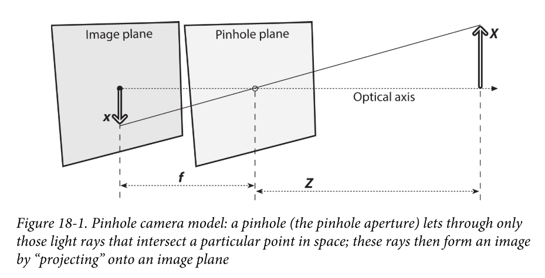
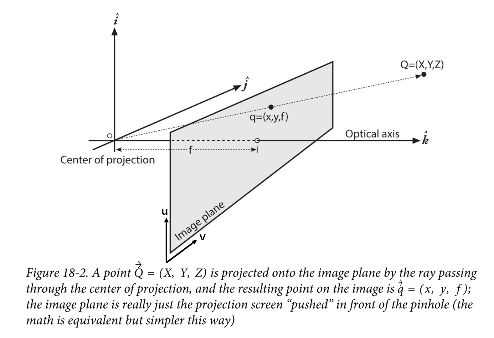

# 【相机标定03】相机模型--内参的组成

一般我们习惯用针孔相机模型来简化相机成像的过程。但是只有一个小孔在短暂曝光的情况下是不能获取足够的光线的，因此实际的相机通常都用透镜来折射更多的光线，但由此也带来了另一个问题--畸变。

故而，标定的目的，直观来讲，就是找出**三维空间中的物体在二维感光元件的投影位置**的计算模型。

我们从小孔成像说起：

根据相似三角形的基本推论，可知：
$$
\begin{align}
-x/f &= \frac {X}{Z} \\
即,  -x &= f \cdot \frac {X}{Z} 
\end{align}\\
$$
这个负号看起来很不舒服，我们把**Image plane 往前移至Pinhole plane**, 等效为：

即：
$$
\begin{align}
x &= f \cdot \frac {X}{Z} ; &y= f \cdot \frac YZ 
\end{align}\\
$$
到目前为止，我们所有的单位都是长度，比如mm，我们要做的事情是把$(x,y)$转为像素表示$(u,v)$。

需要指出的是，pin hole 一般不是在成像平面的中心的，会有些许的偏移。习惯上，把光轴（optical axis）与 Image plane的交点的像素位置记为$(u_0,v_0)$。

那现在就有个问题：$x$到底对应多少个像素呢？如果我们知道了$\hat i$轴方向上$x$值对应的像素个数，那加上$u_0$，就得到了$x$的像素表示$u$ (**本例中像素坐标系的原点在左下角**，方向如上图所示)；同理可求出$v$。

假设在$\hat i$方向上的像素长度为$dx$ ，单位是$mm /pixel$, 表示每个像素的实际尺寸有多少毫米，因此$x$值的像素表示$x_u$为：
$$
\begin{align}
x_u =y \cdot{1\over dx} &= f \cdot {1 \over dx } \cdot {X \over Z}
\end{align}\\
$$
记 $f_x = f \cdot {1 \over dx}$，因此 
$$
\begin{align}
x_u &= f_x \cdot {X \over Z}
\end{align}\\
$$
像素位置等于光心的坐标与相应方向上的偏移量之和，即：
$$
\begin{align}
u &= f_x \cdot {X \over Z} + u_0 ; &v= f_y \cdot {Y \over Z} +v_0
\end{align}\\
$$
最后，我们来写成矩阵的形式：
$$
\begin{align}
Z
\left[
\begin{matrix}
u\\
v\\
1
\end{matrix}
\right]
&=
\left[
\begin{matrix}
f_x & 0 & u_0\\
0 & f_{y} & v_0\\
0 & 0 & 1
\end{matrix}
\right]
\cdot
\left[
\begin{matrix}
X\\
Y\\
Z\
\end{matrix}
\right]
= M\cdot
\left[
\begin{matrix}
X\\
Y\\
Z\
\end{matrix}
\right]
\end{align}\\
$$

$M$就是所谓的相机内参。

#### 小结

总体说来，相机模型的推导还是很简单的，重要的是要了解内参的作用及其中每个参数的物理意义：

- $f_x$: 焦距在$u$方向的像素表示
- $f_y$: 焦距在$v$方向的像素表示
- $u_0$: 光心所在位置的$u$方向像素坐标
- $v_0$: 光心所在位置的$v$方向像素坐标

我们举个例子加深一下印象。以下是一个$640 \times 480$ 分辨率的相机内参：
$$
\left[
\begin{matrix}
5.3398795245975896e+02 & 0.& 3.2838647449406972e+02 \\
0. & 5.2871082110006125e+02 & 2.3684272831168110e+02 \\
0. & 0. & 1.
\end{matrix}
\right]\\
$$
可见，它的光心就没有在正中心$(320,240)$，而是在 $(328,236)$ 处。

本节不再介绍畸变的相关内容，该部分相对独立，读者可自行查找资料学习。

学完了内参之后，再联系前两节的内容，我们就很容易总结出：

- **内参是用来将相机坐标投影成像素坐标**
- **外参是用来将世界坐标转换至相机坐标**

#### References

Adrian Kaehler, Gary Bradski - Learning OpenCV 3_ Computer Vision in C++ with the OpenCV Library (2017, O’Reilly Media) 

