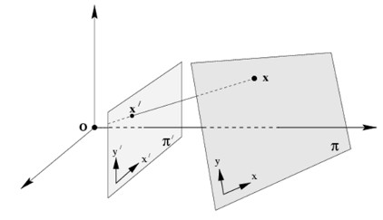
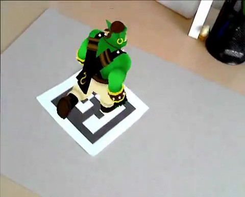
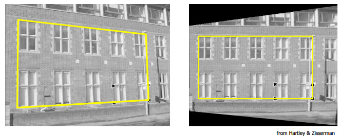
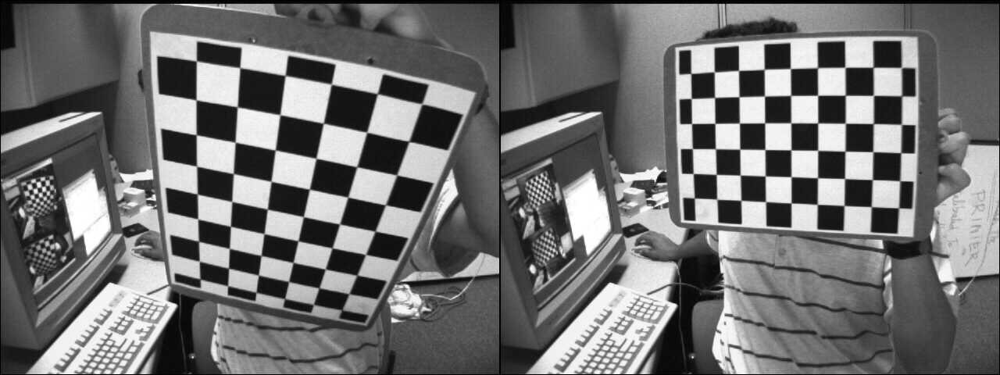
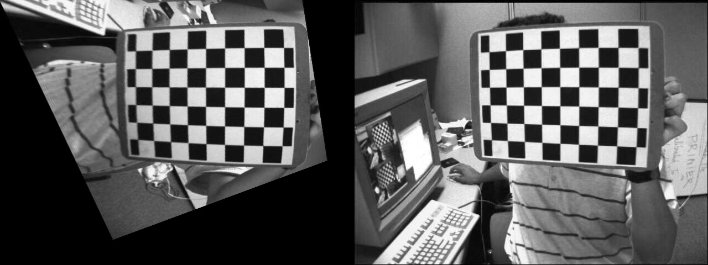

# 【相机标定04】单应矩阵的作用

通俗地讲，**单应矩阵**（homography matrix）描述的是共面的点从一个视角的拍摄图像转化为另一个视角所拍摄图像的变换关系。单应性变换（姑且把使用单应矩阵的变换称作**单应性变换**）其本质上属于射影变换（perspective transformation），而这种单应性就是实际中相机的工作原理。

#### 应用

##### 1 从物体平面到成像平面的转换：



我们可以做相机的姿态估计（Camera pose estimation），利用姿态可以做相机标定（这也是在讲相机标定之前介绍单应矩阵的原因，留在之后细说），或增强现实，如图：



##### 2 从不同位置拍摄的同一个平面的两个图像之间的变换

其实就是间接转换两次：


可用作透视校正（Perspective correction）：



##### 3 旋转相机拍摄的两张图片

可认为重叠部分的景物处于无限远的同一平面上。


最常用的场景就是全景拼接：


#### 示例代码

本文演示单应矩阵的第2类应用透视校正，将一张图片转换到另一张图片的视角下。原图如下：



通过观察，画面中的棋盘格是共面的，因此我们实现步骤为：

- 找出棋盘格的角点坐标，并匹配
- 计算该转换的单应矩阵
- 应用单应矩阵进行图片变换

OpenCV中为我们提供了易用的接口`findHomography`，通过输入两图对应点的像素坐标，就可求出单应矩阵。示例代码如下：

```c++
#include <iostream>
#include <opencv2/core.hpp>
#include <opencv2/imgproc.hpp>
#include <opencv2/calib3d.hpp>
#include <opencv2/highgui.hpp>

using namespace std;
using namespace cv;

void perspectiveCorrection(const string &img1Path, const string &img2Path, const Size &patternSize)
{
    Mat img1 = imread( samples::findFile(img1Path) );
    Mat img2 = imread( samples::findFile(img2Path) );

    //! [find-corners]
    vector<Point2f> corners1, corners2;
    bool found1 = findChessboardCorners(img1, patternSize, corners1);
    bool found2 = findChessboardCorners(img2, patternSize, corners2);
    //! [find-corners]

    if (!found1 || !found2)
    {
        cout << "Error, cannot find the chessboard corners in both images." << endl;
        return;
    }

    //! [estimate-homography]
    Mat H = findHomography(corners1, corners2);
    cout << "H:\n" << H << endl;
    //! [estimate-homography]

    //! [warp-chessboard]
    Mat img1_warp;
    warpPerspective(img1, img1_warp, H, img1.size());
    //! [warp-chessboard]

    Mat img_draw_warp;
    hconcat(img1_warp, img2, img_draw_warp);
    imwrite("test/calibration/perspective.jpg",img_draw_warp);
}
```

`findChessboardCorners`也是一个重要的函数，可用来查找棋盘格的角点像素坐标。

结果如图：



左图为变换过后的效果，可见棋盘处在了相同的位置和视角。

#### 小结

单应矩阵的应用是比较广泛的，比如转换为鸟瞰图、更换图片的特定位置等。其核心思想就是确定共面的点来求解。

相机的成像过程本身在不考虑畸变的情况下就是单应性变换，利用特定的标识物就可以估计相机的姿态该部分下一节会继续介绍。

#### References

[OpenCV: Basic concepts of the homography explained with code](https://docs.opencv.org/4.5.2/d9/dab/tutorial_homography.html)

