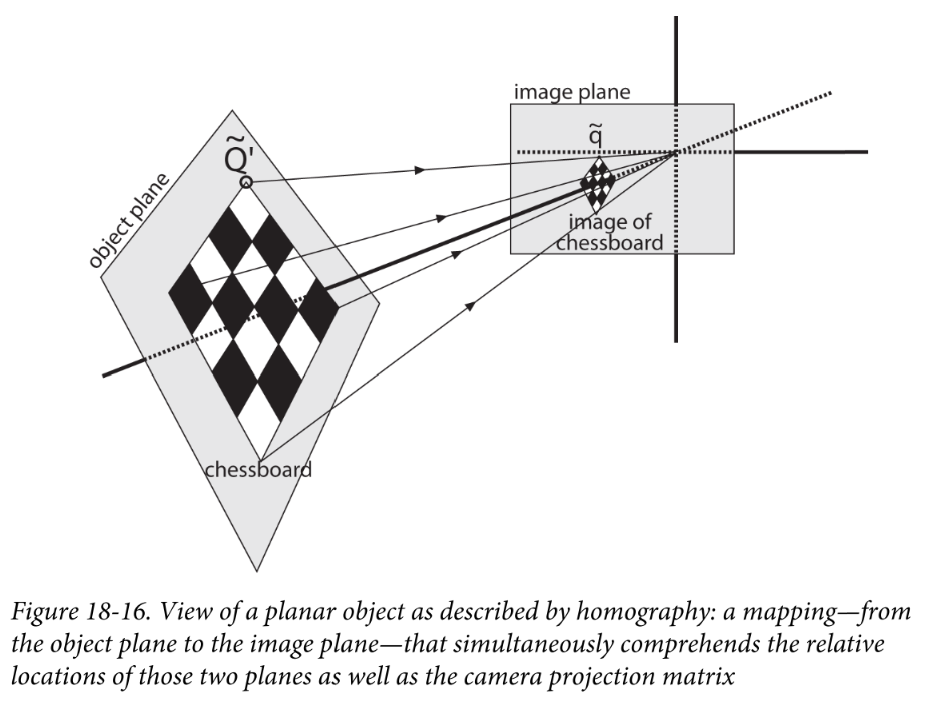

# 【相机标定05】单应矩阵的由来

在[【相机标定02】从世界坐标系到像素坐标系](https://zhuanlan.zhihu.com/p/423473576)中，我们已经知道一个世界坐标系中的点投影到像素坐标系的过程为：

$$
\begin{align}
w
\left[
\begin{matrix}
u\\
v\\
1
\end{matrix}
\right]
&=
\left[
\begin{matrix}
f_x & 0 & c_{x} & 0\\
0 & f_{y} & c_{y} & 0\\
0 & 0 & 1 & 0
\end{matrix}
\right]
\cdot
\left[
\begin{matrix}
r_{11} & r_{12} & r_{13} & T_x\\
r_{21} & r_{22} & r_{23} & T_y\\
r_{31} & r_{32} & r_{33} & T_z\\
0 &　0 & 0 & 1
\end{matrix}
\right]
\cdot
\left[
\begin{matrix}
x_o\\
y_o\\
z_o\\
1
\end{matrix}
\right]\\
&=
\left[
\begin{matrix}
f_x & 0 & c_{x} \\
0 & f_{y} & c_{y} \\
0 & 0 & 1 
\end{matrix}
\right]
\cdot
\left[
\begin{matrix}
r_{11} & r_{12} & r_{13} & T_x\\
r_{21} & r_{22} & r_{23} & T_y\\
r_{31} & r_{32} & r_{33} & T_z
\end{matrix}
\right]
\cdot
\left[
\begin{matrix}
x_o\\
y_o\\
z_o\\
1
\end{matrix}
\right]

\end{align}\\
$$

我们用一个简单的式子来概括上面的投影过程：
$$
\begin{align}
\vec p &= s \cdot M \cdot W \cdot \vec Q
\end{align}\\
$$
其中$\vec p=\left[\begin{matrix}u\\v\\1\end{matrix}\right] $，$s=1/w$，$M$为内参，$W=\left[\begin{matrix}\vec r_1 & \vec r_2 & \vec r3 & \vec t\end{matrix} \right]$为外参，$\vec Q=\left[\begin{matrix}x_o\\y_o\\z_o\\1\end{matrix}\right]$。

到这里，我们需要停下来思考一下，上式的已知量是哪些，哪些又是未知的。内参$M$是我们需要标定的未知量，外参W也是未知的；$p$可以从图片上查得，$Q$是人为选择的，这两个点都是已知的。

但由于$Q$所在的世界坐标系是人为定义的，我们就可以简化求解过程，让$z_o=0$，也就是所有的点都在同一个平面上且z轴为0，由此，可以将卡式简化为：
$$
\begin{align}
\vec p &= s \cdot M \cdot 
\left[
\begin{matrix}
\vec r_1 & \vec r_2 & \vec r3 & \vec t
\end{matrix} \right]
\cdot
\left[
\begin{matrix}
x_o\\
y_o\\
0\\
1
\end{matrix}
\right]\\
&=
s \cdot M \cdot 
\left[
\begin{matrix}
\vec r_1 & \vec r_2 & \vec t
\end{matrix} \right]
\cdot
\left[
\begin{matrix}
x_o\\
y_o\\
1
\end{matrix}
\right]\\
&= s \cdot H \cdot \vec Q^\prime

\end{align}\\
$$

其中，$H= s \cdot M \cdot \left[\begin{matrix}\vec r_1 & \vec r_2 & \vec t\end{matrix} \right]$ 是一个$3 \times 3$的矩阵，称之为单应矩阵（Homography matrix）。

用一幅图总结一下这个过程：

#### 小结

共面的点可以通过同一个变换$H$映射到成像平面上，这就是矩阵的全部意义。同时，我们注意到单应矩阵是融入了内参的，因此内参的估计就可以从求解单应矩阵开始。到这里我们已经了解了相机内参估计的重点前置知识，这也是即将介绍的`张氏标定法`的核心思想。
