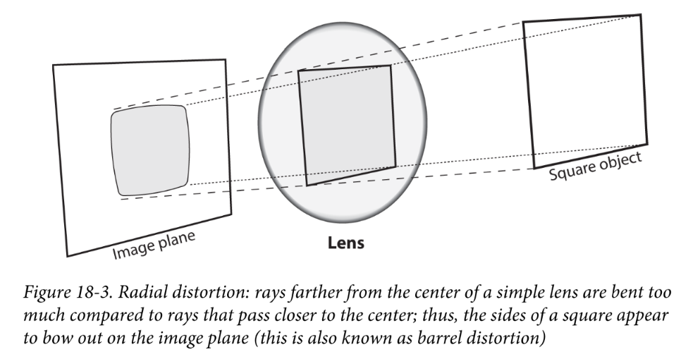
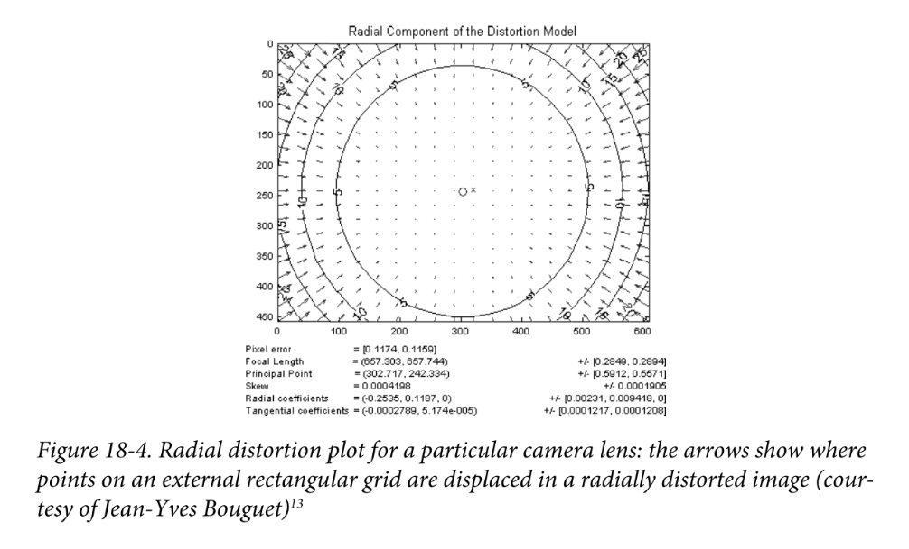
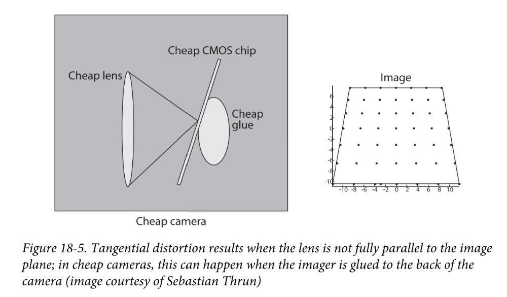

# 【相机标定08】镜头畸变与图片矫正

之前的文章为了推导的便利是完全没有考虑镜头引起的畸变情形，但实际上，任何镜头都不可能是没有畸变的。畸变是在镜头的制造过程中产生的。透镜的畸变主要分为两类：**径向畸变**和**切向畸变**

#### 径向畸变（Radial distortion）

径向畸变是由于透镜表面的弧度引起的光线折射角不同造成的，因此越靠镜头的边缘畸变越严重，光心处零畸变。如下图所示：

对于径向畸变，可以用光心（optical center，下式的 $(x, y)$ ）周围距离为$r$的泰勒级数展开式的前几项进行描述，通常使用前两项就足够了，即 $k_1$ 和 $k_2$ ，对于畸变更大的镜头，如鱼眼镜头，可以增加使用第三项 $k_3$ 来进行描述:
$$
\left\{
\begin{aligned} 
x_{corrected} &= x \cdot \left( 1+ k_1r^2 +k_2r^4+k_3r^6 \right) \\
y_{corrected} &= y \cdot \left( 1+ k_1r^2 +k_2r^4+k_3r^6 \right) \\
\end{aligned} 
\right.
\tag{1}
$$
可能读者会好奇为什么只有偶数次幂的项，这里稍作解释。$r$ 在 $0$ 点的泰勒展开形式为：
$$
f(r) = a_0 +a_1r + a_2r^2+ \ldots
$$
当 $f(r=0)=0$ , 即 $a_0=0$ , 又镜头是对称的，故仅剩余偶数次幂的项。

径向畸变的结果可参考下图：

#### 切向畸变（tangential distortion）

切向畸变的产生主要归结于装配的瑕疵，使镜头与成像平面不平行，如下图：

