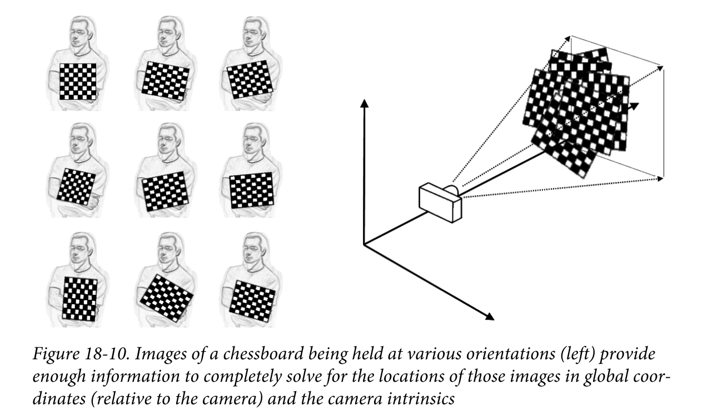

# 【相机标定09】单目标定实践

经过前面一共8篇的漫长铺垫，终于迎来了本系列【单目相机标定】的最后一篇，标定实践篇。

首先我们总结一下标定的思路：

- 内参是从单应矩阵中解出的
- 获得单应矩阵的方法是找出共面的点集
- 人为地设计出已知3D坐标且共面的点

因此，张氏标定法自然而然地选取了黑白相间的棋盘格。如下图所示：



这样一来，我们可以通过简单的算法识别出棋盘中是角点，也就是方格相连的交叉点，这样通过一张图片就可以获取不少共面的点对。大大提高算法的精确性。


#### 标定实践

标定的代码OpenCV官方教程早已给出https://github.com/opencv/opencv/blob/1b443219ed181124978ed8627fb2da8db42765ab/samples/cpp/calibration.cpp，我们复制出来可直接使用。

由于本文示例需要显示图片，就在Windows下使用Visual Studio运行。

新建C++ 工程，首次编译会出现以下错误：


按提示增加预处理器定义`_CRT_SECURE_NO_WARNINGS`:


再次编译即成功。

##### 准备标定图片

此处依然使用opencv官方教程中提供的图片：


另外需要准备一个yml文件left_imagelist.yml，用来记录要使用的图片文件名列表：

```yaml
%YAML:1.0
images:
  - left01.jpg
  - left02.jpg
  - left03.jpg
  - left04.jpg
  - left05.jpg
  - left06.jpg
  - left07.jpg
  - left08.jpg
  - left09.jpg
  - left11.jpg
  - left12.jpg
  - left13.jpg
  - left14.jpg
```

最后把这些文件复制到生成文件夹下。

##### 执行标定

通过命令行执行：

```powershell
.\CameraCalibrator.exe -w=8 -h=6 -s="0.025" left_imagelist.yml
```

标定过程中会显示棋盘格角点识别结果：


同时生成了内参文件`out_camera_data.yml`：

```yaml
%YAML:1.0
---
calibration_time: "Sat Dec 11 23:20:20 2021"
image_width: 640
image_height: 480
board_width: 8
board_height: 6
square_size: 2.5000000372529030e-02
flags: 0
camera_matrix: !!opencv-matrix
   rows: 3
   cols: 3
   dt: d
   data: [ 5.3316448958606009e+02, 0., 3.4188548210791566e+02, 0.,
       5.3318553570626648e+02, 2.3466469805918837e+02, 0., 0., 1. ]
distortion_coefficients: !!opencv-matrix
   rows: 5
   cols: 1
   dt: d
   data: [ -2.8595456350976978e-01, 8.3271229027874399e-02,
       1.2055844097240325e-03, 3.6659412039036431e-05, 0. ]
avg_reprojection_error: 1.6949156437916027e-01

```


#### 关键代码

代码中直接调用了`calibrateCameraRO`，但更核心的方法其实为`calibrateCamera`:

```c++
double calibrateCamera( InputArrayOfArrays objectPoints,
                       InputArrayOfArrays imagePoints, Size imageSize,
                       InputOutputArray cameraMatrix, InputOutputArray distCoeffs,
                       OutputArrayOfArrays rvecs, OutputArrayOfArrays tvecs,
                       int flags = 0, TermCriteria criteria = TermCriteria(
                           TermCriteria::COUNT + TermCriteria::EPS, 30, DBL_EPSILON) );
```

简单说，就是把空间3D点对与像素点对匹配，通过前面章节介绍的方法计算出来。

#### 小结

作为单目标定的最后一节，本文仅仅是提供了一个现成的标定方法，方便读者实践。更普遍的方式是使用现成的工具进行标定，比如Matlab工具包。

最后，单目完结，双目还会远吗！
