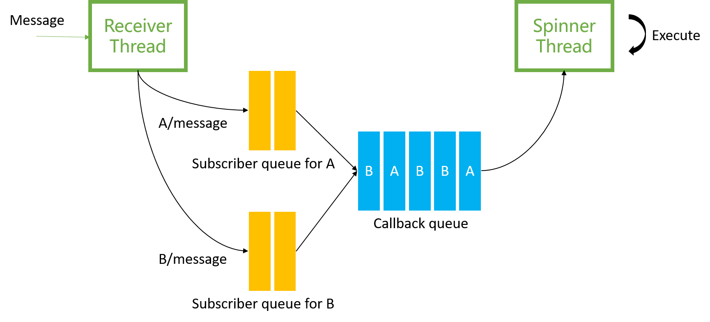
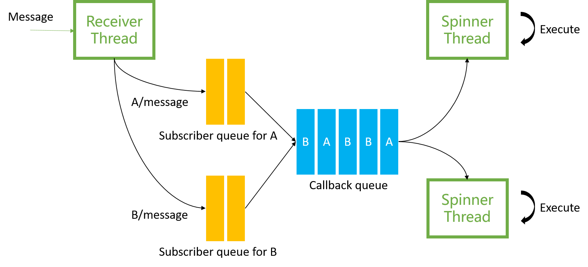
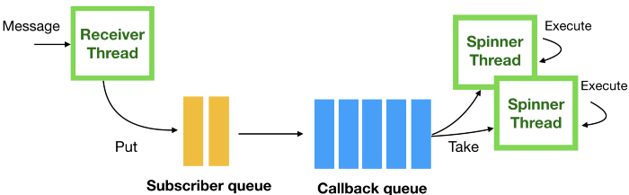
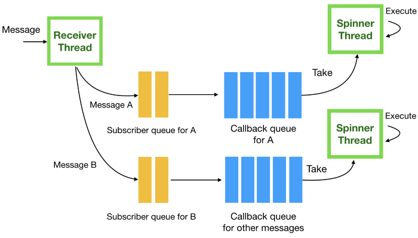

# 动手学ROS（7）：精讲多线程之MultiThreadedSpinner

之前的全部示例代码，我们都是用默认的单线程来处理任务，但顺序执行的方式在很多时候是不能保证时效性的，因此我们有必要来看看ros里面怎么使用多线程来处理回调任务。

> 目录
>
> - 单线程的问题：订阅多个Topic，一个Spinner thread
> - 多线程：订阅多个Topic，多个Spinner threads
> - 订阅一个Topic，多个Spinner threads
> - 订阅多个Topic，每个Subscriber一个Callback queue

#### 1 单线程的问题

现在我们设定一个场景，利用《动手学ROS（6）：命名空间之group与remap》中的multi_publisher.launch，分别以1Hz的速率向A/message和B/message发送消息，我们写一个接收端，其中CallbackA在处理A/message时会sleep 2s, CallbackB无间隔，我们来看看执行的效果。

Subscriber代码如下：

```c++
#include <thread>
#include "ros/ros.h"
#include "std_msgs/String.h"
void CallbackA(const std_msgs::String::ConstPtr &msg)
{
    std::this_thread::sleep_for(std::chrono::seconds(2));
    ROS_INFO(" I heard: [%s]", msg->data.c_str());
}
void CallbackB(const std_msgs::String::ConstPtr &msg)
{
    ROS_INFO(" I heard: [%s]", msg->data.c_str());
}
int main(int argc, char **argv)
{
    ros::init(argc, argv, "listener");
    ros::NodeHandle n;
    ros::Subscriber sub_b = n.subscribe("B/message", 1, CallbackB);

    ros::Subscriber sub_a = n.subscribe("A/message", 1, CallbackA);
    ros::spin();

    return 0;
}
```

结果显示，CallbackB也跟着变成2s的调用频率。日志如下（注意打印时间）：

```
[ INFO] [1621391346.653984500]:  I heard: [/A/message 1]
[ INFO] [1621391346.656312400]:  I heard: [/B/message 2]
[ INFO] [1621391348.656641300]:  I heard: [/A/message 3]
[ INFO] [1621391348.656849300]:  I heard: [/B/message 4]
[ INFO] [1621391350.657389800]:  I heard: [/A/message 5]
[ INFO] [1621391350.657563600]:  I heard: [/B/message 6]
```



一图胜千言，在只有一个Spinner thread的情况下，callback queue只能顺序执行。

这就说明了单线程的不足，不管有多少个Subscriber，节点都只能顺序执行回调，这在某些时候是不能忍受的，因此，多线程有了用武之地，我们要做的事情就是增加spinner thread。


#### 2 多线程：订阅多个Topic，多个Spinner threads

我们修改刚刚的Subcriber, 其实也就改了两行：

```c++
#include <thread>
#include "ros/ros.h"
#include "std_msgs/String.h"
void CallbackA(const std_msgs::String::ConstPtr &msg)
{
    std::this_thread::sleep_for(std::chrono::seconds(2));
    ROS_INFO(" I heard: [%s]", msg->data.c_str());
}
void CallbackB(const std_msgs::String::ConstPtr &msg)
{
    ROS_INFO(" I heard: [%s]", msg->data.c_str());
}
int main(int argc, char **argv)
{
    ros::init(argc, argv, "listener");
    ros::NodeHandle n;
    ros::Subscriber sub_b = n.subscribe("B/message", 1, CallbackB);

    ros::Subscriber sub_a = n.subscribe("A/message", 1, CallbackA);
    //改变的地方
    ros::MultiThreadedSpinner spinner(2);
    spinner.spin();

    return 0;
}
```

MultiThreadedSpinner可初始化线程的数量，这里因为有两个subscriber，就选择了2。Callback依然是2s调用一次。测试结果如下：

```
[ INFO] [1621390946.100496300]:  I heard: [/B/message 1]
[ INFO] [1621390947.100450900]:  I heard: [/B/message 2]
[ INFO] [1621390948.015270200]:  I heard: [/A/message 1]
[ INFO] [1621390948.099850900]:  I heard: [/B/message 3]
[ INFO] [1621390949.100118400]:  I heard: [/B/message 4]
[ INFO] [1621390950.015475900]:  I heard: [/A/message 3]
[ INFO] [1621390950.100807500]:  I heard: [/B/message 5]
[ INFO] [1621390951.100232500]:  I heard: [/B/message 6]
[ INFO] [1621390952.015688200]:  I heard: [/A/message 5]
```

CallbackB处理了B/message中的所有消息(1,2,3,4,5,6)，而CallbackA还是2s调用一次，只处理了A/message中编号为1，3，5的消息。也就是说，我们有一个空闲的线程在另一个线程被CallbackA占用时可以从容地处理CallbackB。如下图：



#### 3 订阅一个Topic，多个Spinner threads

假设只有一个Topic, 发布端的频率比较高，我们又想尽可能多地响应消息，因此我们可以设置多个Spinner，但是单纯地像上一小节一样使用MultiThreadedSpinner是不行的，ros作了限制，默认阻止并行处理一个Callback，我们需要更改Suscriber的配置：

```c++
#include <thread>
#include "ros/ros.h"
#include "std_msgs/String.h"

void ChatterCallback(const std_msgs::String::ConstPtr& msg) {
  ROS_INFO(" I heard: [%s]", msg->data.c_str());
  std::this_thread::sleep_for(std::chrono::seconds(2));
}
int main(int argc, char **argv) {
  ros::init(argc, argv, "listener");
  
  ros::NodeHandle n;
  ros::SubscribeOptions ops;
  ops.init<std_msgs::String>("A/message", 1, ChatterCallback);
  ops.allow_concurrent_callbacks = true;
  ros::Subscriber sub1 = n.subscribe(ops);
  ros::MultiThreadedSpinner spinner(2);
  
  spinner.spin();
  return 0;
}
```

可以看到，通过设置SubscribeOptions的allow_concurrent_callbacks为true，就可以让同一个Callback并行执行，结果如下：

```
[ INFO] [1621397291.938394800]:  I heard: [/A/message 1]
[ INFO] [1621397292.938467100]:  I heard: [/A/message 2]
[ INFO] [1621397293.940122300]:  I heard: [/A/message 3]
[ INFO] [1621397294.938827600]:  I heard: [/A/message 4]
[ INFO] [1621397295.940477900]:  I heard: [/A/message 5]
[ INFO] [1621397296.939098400]:  I heard: [/A/message 6]
```

虽然ChatterCallback中仍然是等待2s，但实际上却处理了每一秒接收到的消息。如图：



#### 4 订阅多个Topic，每个Subscriber一个Callback queue

在[《ROS Spinning, Threading, Queuing》](https://levelup.gitconnected.com/ros-spinning-threading-queuing-aac9c0a793f)的最后还提到了一种更加优秀的实践方式：

> if there is only one callback queue which is FIFO queue (first in, first out), the callback for the message A cannot be processed until all three callbacks for the message B are processed. **This problem can be mitigated by creating multi spinner threads** as talked before, but it cannot completely solve the issue which stems from having a single callback queue.
>
> To solve the problem, we can create **a separate callback queue and spinner thread which is dedicated to the message A** as shown below.



```c++
#include <thread>
#include <ros/callback_queue.h>
#include "ros/ros.h"
#include "std_msgs/String.h"
void CallbackA(const std_msgs::String::ConstPtr& msg) {
  ROS_INFO(" I heard: [%s]", msg->data.c_str());
}
void CallbackB(const std_msgs::String::ConstPtr& msg) {
  ROS_INFO(" I heard: [%s]", msg->data.c_str());
}
int main(int argc, char **argv) {
  ros::init(argc, argv, "listener");
  ros::NodeHandle n;
  ros::Subscriber sub_b = n.subscribe("MessageB", 1, CallbackB);
  
  ros::NodeHandle n_a;
  ros::CallbackQueue callback_queue_a;
  n_a.setCallbackQueue(&callback_queue_a);
  ros::Subscriber sub_a = n_a.subscribe("MessageA", 1, CallbackA);
  std::thread spinner_thread_a([&callback_queue_a]() {
    ros::SingleThreadedSpinner spinner_a;
    spinner_a.spin(&callback_queue_a);
  });
  ros::spin();
  spinner_thread_a.join();
  return 0;
}
```

给每一个subscriber创建一个单独的callback queue，这样就解决了即使用了MultiThreadedSpinner但所有的callback依然在同一个queue排除执行的问题，此方法用来解决subscriber的优先级问题。笔者在实际中未遇到使用该方法的地方，仅记录在此，保持文章的完整性。

#### 小结

1. MultiThreadedSpinner可使节点多线程执行任务；
2. 要使一个Subscriber多线程执行，需设置SubscribeOptions的allow_concurrent_callbacks为true；
3. 如果需要保证某个Subscriber优先执行，可配置其独立的CallbackQueue；
4. 其实还有个AsyncSpinner提供和MultiThreadedSpinner类似的功能，有机会再介绍。

