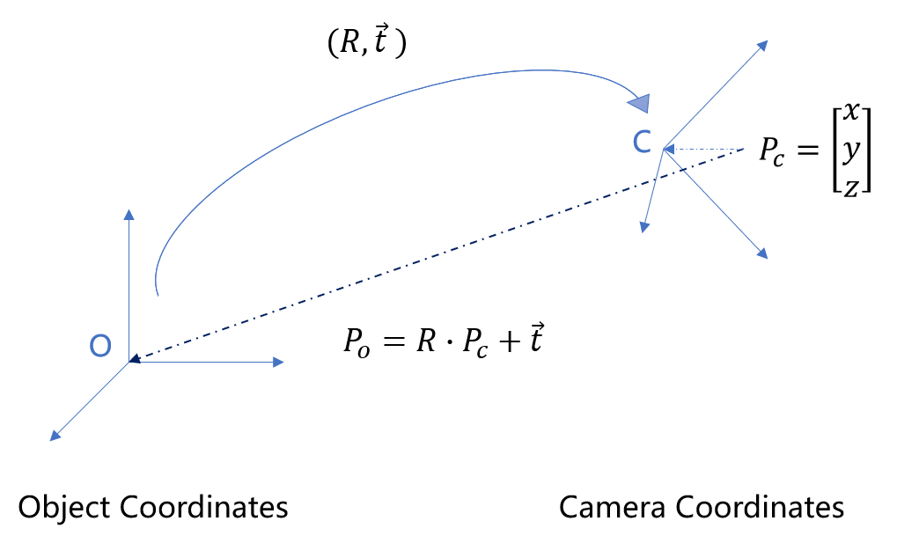
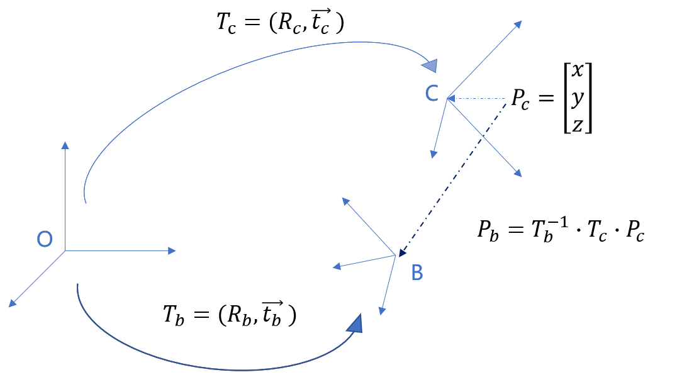
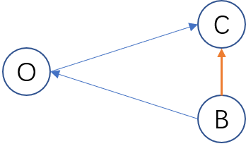

# 动手学ROS（8）：坐标系间的欧氏变换

之前的文章仅仅是让我们可以run起来ros程序，没有涉及到任何实际的应用场景。起初的想法也只是记录下来基本的ros用法，防止遗忘，但是现在渐渐喜欢上了这种表达方式，决定尽可能多地把自己总结的经验方法加工后展现在这里。

本节的内容不多，但曾经也是多次计算错误后，才决定彻底把坐标变换搞明白的。同时，本节会需要一些前置知识：欧氏变换、旋转向量、四元数，这些都是基本的数学概念，希望读者自行学习，这里不再赘述。

#### 两个坐标系间的变换

在开始具体地讲解之前，有两个特别容易混淆的表述：

- 坐标系的变换
- 点在坐标系间的变换

前者表示两个坐标系原点到原点的变换关系；后者说的是一个坐标系的点在另一个坐标系中如何表达。本节会多次提到这两种说法，请读者注意。

请看下图，我们先把这两个概念搞清楚：

从坐标系**Object**（以下简称$C_o$）到坐标系**Camera**（以下简称$C_c$）的变换为$(R,\vec t)$ ，这就是坐标系间的变换，R表示旋转矩阵，$\vec t$表示平移向量。

$P_c$是$C_c$中一点，求该点在$C_o$中的坐标$P_o$，这就是点在坐标系间的变换。

图中已经给出了计算方法，$P_o=R \cdot P_c + \vec t $ 。这个式子本身没有什么可说的，这里提供一个记忆的方法：

> 假设在$C_o$中有一点$P_f$，它的坐标与$P_c$相对$C_c$一样，同为$(x,y,z)$，那坐标系$C_o$通过$(R,\vec t)$变换到$C_c$后，$P_f$将与$P_c$重合，即为要求的$P_o$。

#### 多个坐标系间的转换

我们只举一个三个坐标系间转换的例子，三个以上同理。

如上图，我们在刚才例子的基础上增加一个坐标系$C_b$，$P_c$是$C_c$中一点，已知坐标系$C_c$和$C_b$相对于世界坐标系$C_o$的转换关系，求该点在$C_b$中的坐标$P_b$。为了书写方便，坐标之间的变换采用变换矩阵$T$表示。变换矩阵也就是把rotation和translation写成齐次的形式。

我们使用刚才的公式连续转换就可以了，第一步转到$C_o(T_c \cdot P_c)$，然后再转到$C_b$。第二步的时候，我们需要从B到O的变换矩阵，简单地求个逆就好了，即$T_b^{-1}$。最后再乘起来$P_b=T_b^{-1} \cdot T_c \cdot P_c$。

到这里，我们可以再换个角度来看下上面的公式，$T_b^{-1} \cdot T_c$就是坐标系B到C的变换，最后再画个图来强化一个记忆：

留意箭头的方向，所求的$B->C=B->C \cdot O->C$。类似于向量的加法，不过次序一定要保持从头到尾的指向。

#### 小结

本节仅是提供了一个更Intuitive的方式来记忆和理解坐标系间的转换，这样写代码时不容易出错。后续会提供常用的代码示例。

