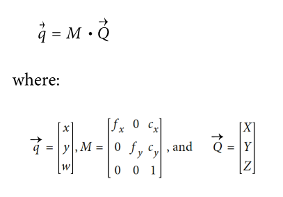
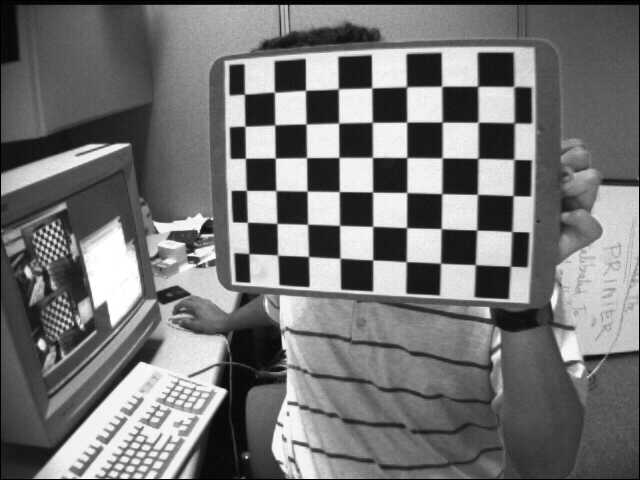

# 相机标定01：内参的作用--投影

本节以及接下来的几节计划着重介绍机器人视觉相关的传感器：RGB相机、RGB-D相机和lidar。文章不会涉及如何组装、安装、拉流等，而标定问题笔者认为是机器人应用中比较重要的基础环节，本文就从最简单的单目相机标定开始。

在《Learning OpenCV 》的chapter 18中有针孔相机模型详细的推导过程，网上也有很多相关的文章，本文通过一个将**标定结果实际运用**的例子使读者对相机标定有一个宏观的认识，以辅助理解标定的意义。

#### 内参含义

我们把需要标定的相机参数叫做内参（intrinsics matrix），它决定了物体的实际位置$Q$在成像平面上的投影位置$q$，如下图所示：


数学表示为：



可见，内参$M$的组成元素包含焦距$f$(像素表示)和成像平面的中心$c$。

#### 内参应用

我们使用opencv samples中的标定图像[left01.jpg](https://github.com/opencv/opencv/blob/master/samples/data/left01.jpg)作为素材，运用实际标定后的内参和测算后的棋盘格角点的空间坐标，将角点投影至图像上。



opencv提供了一个投影方法：`cv2.projectPoints`，示例代码如下：

```python
import numpy as np
import cv2

def project2d(points,m):
    d0=np.array([0,0,0,0,0],np.float32)
    pts, jac = cv2.projectPoints(points, np.array([0,0,0], np.float32), np.array([0,0,0], np.float32), m, d0)
    pts = np.int32(pts).reshape(-1,2)
    return pts

def project2d_simple(points,m):
    pts=[]
    for point in points:
        pt=np.matmul(m,point)
        pt=pt/pt[2]
        pts.append(pt[:2])
    return np.int32(pts).reshape(-1,2)

def draw_point(img, points):
    for point in points:
        cv2.circle(img,tuple(point.ravel()),3,(0,255,0),3,cv2.LINE_8)
      
if __name__ =="__main__":
    m1=np.array([[5.3398795245975896e+02, 0., 3.2838647449406972e+02],
       [0.,5.2871082110006125e+02, 2.3684272831168110e+02],
       [0., 0., 1.]])
    
    img_l_file="test/projection/left01.jpg"
    img_l=cv2.imread(img_l_file)


    points=np.array([[-48.831894, -86.462112, 316.351135],[-29.942320, -85.639320, 311.097839],[-11.202976, -85.063042, 306.122345]])
    
    pts=project2d(points,m1)
    draw_point(img_l,pts)


    cv2.imwrite('projection_demo_l.jpg',img_l)
```

结果如下图：


代码说明：

- cv2.projectPoints中参数较多，按顺序为 3d点序列、对点的空间就换rvec及tvec、内参、畸变参数d。因本次操作不需要对点进行空间变换，因此rvec和tvec都为0，本次我们先不考虑去畸变，d也取0。
- draw_point为画点的辅助函数，其实就是画实心圆
- points为事先通过双目测距计算出来的3D点，选取了前3个，后续文章会公开代码
- 内参m1为事先通过图像标定出的实际内参，后续文章会介绍方法
- 本示例使用了opencv的函数，读者完全可以通过矩阵乘法来得到相同的结果，代码请参考`project2d_simple`。为了便于理解用了for循环，其实矩阵乘法效率更高，仅供学习参考。

#### 小结

从结果可以看出，投影的位置是符合预期的。本文的目的是让初学者对标定内参有一个较为直观的理解，因为具体的标定方法都已经是很成熟且易用的，因此理解基本理论显得更为重要。不过相机模型及标定算法的优秀文章已有很多，本系列教程依然注重实际应用，通过对重点概念的解释，清除学习上的障碍。
